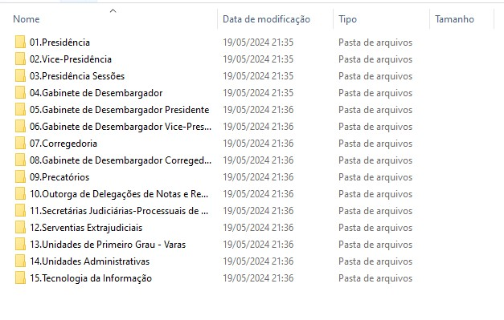

# Scripts de importação dos formulário de inspeção CN/CNJ

## Sequência de execução do script:
1. Solicita o código de inspeção, ou seja, a senha informada para acesso aos formulários de determinada inspeção e.g TJXX@2024;
2. Criação da pasta **Arquivos Formulários de Inspeção** na pastas documentos do usuário;
3. Faz o download do arquivo **links_formularios_inspecao.txt** que contém os links de download das entradas do formulário informado no passo 1;
4. Cria uma pasta de cada formulário em uma pasta de mesmo nome do código de inspeção informado;
5. Baixa todos os formulários, em formato pdf, e seus anexos dentro de cada pasta de formulário;

*Exemplo de estrutura de diretórios criada.*

## Uso do script:
1. Gerar um executável usando o pyinstaller (pip install pyinstaller ou conda install pyinstaller);
2. Comando do gerador de executável: `pyinstaller --onefile --hidden-import openpyxl.cell._writer inspecao_main.py`;
3. A opção --hidden-import importa o pacote não visível no script openpyxl.cell._writer
4. Verificar outras opções do pyinstaller em [PyInstaller Manual](https://pyinstaller.org/en/stable/).

## Links para os formulários
1. [Presidência](https://formularios-corregedoria.cnj.jus.br/01-inspecao-ordinaria-presidencia/)
2. [Vice-Presidência](https://formularios-corregedoria.cnj.jus.br/02-inspecao-ordinaria-vice-presidencia/)
3. [Presidência de Sessões](https://formularios-corregedoria.cnj.jus.br/03-inspecao-ordinaria-presidencia-de-sessoes/)
4. [Gabinete de Desembargador(a)](https://formularios-corregedoria.cnj.jus.br/04-inspecao-ordinaria-gabinete-de-desembargador/)
5. [Gabinete de Desembargador(a) Presidente](https://formularios-corregedoria.cnj.jus.br/05-inspecao-ordinaria-gabinete-de-desembargador-presidente/)
6. [Gabinete de Desembargador(a) Vice-Presidente](https://formularios-corregedoria.cnj.jus.br/06-inspecao-ordinaria-gabinete-de-desembargador-vice-presidente/)
7. [Corregedoria](https://formularios-corregedoria.cnj.jus.br/07-inspecao-ordinaria-corregedoria/)
8. [Gabinete Desembargador(a) Corregedor(a)](https://formularios-corregedoria.cnj.jus.br/08-inspecao-ordinaria-gabinete-de-desembargador-corregedor/)
9. [Precatórios](https://formularios-corregedoria.cnj.jus.br/09-inspecao-ordinaria-precatorios/)
10. [Concurso Público Extrajudicial](https://formularios-corregedoria.cnj.jus.br/10-inspecao-ordinaria-concurso-publico-outorga-de-delegacoes-de-notas-e-registro-e-listas-de-vacancias/)
11. [Secretarias Judiciárias 2º Grau](https://formularios-corregedoria.cnj.jus.br/11-inspecao-ordinaria-secretarias-judiciarias-processuais-de-2o-grau/)
12. [Serventias Extrajudiciais](https://formularios-corregedoria.cnj.jus.br/12-inspecao-ordinaria-serventias-extrajudiciais/)
13. [Unidades de 1º Grau](https://formularios-corregedoria.cnj.jus.br/13-inspecao-ordinaria-unidades-de-primeiro-grau-varas/)
14. [Administrativo](https://formularios-corregedoria.cnj.jus.br/14-inspecao-ordinaria-unidades-administrativas/)
15. [Tecnologia da Informação](https://formularios-corregedoria.cnj.jus.br/15-inspecao-ordinaria-tecnologia-da-informacao/)

